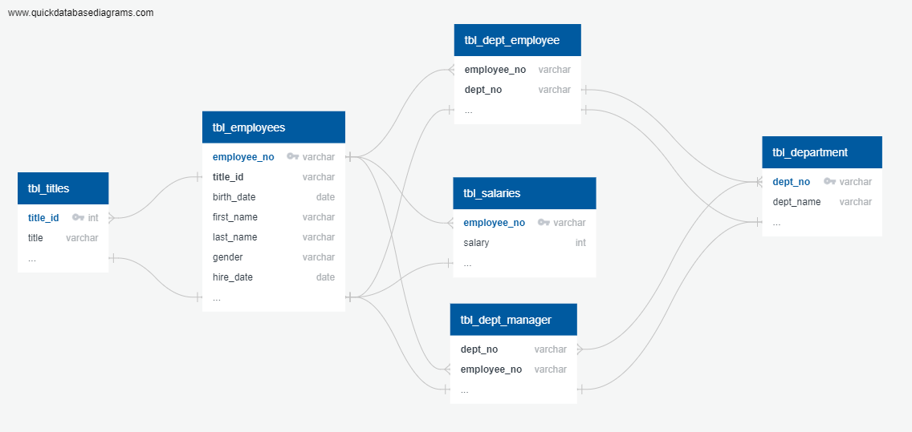

# Database Creation Using PostgreSQL
This repo is a demonstration in my ability to create a database in PostgreSQL and query various types of information from that database. The database is created around employee information (salary, department, hire date, etc) for a given company. 
In this repo you will find:
|PostgreSQL scripts  | Description |
| ------------- | ------------- |
| [Table Schema Script](table_schema.sql) | A script that builds the table schema for the database when run.  |
| [Query Script](query_script.sql)  | A script containing several example queries one could make to pull information from the database. |

## Datafiles
These are the datafiles imported to the database. Included are 6 .csv files. Their names 
| CSV  | Description | Relative Table|
| ------------- | ------------- | ----------|
| [Department info](data/departments.csv) | A csv file containing the department name and its associated number. | tbl_department|
| [Employee per Department](data/dept_emp.csv) | A csv file containing all employee numbers and the associated department number they work in.  | tbl_dept_employee|
| [Manager per Department](data/dept_manager.csv) | A csv file containing all manager numbers and the associated department number they work in.  | tbl_dept_manager|
| [Employee](data/employees.csv) | A csv file containing all employee numbers, their title, their birth date, their first name, last name, their sex, and their hire date. | tbl_dept_employees|
| [Salaries](data/salaries.csv) | A csv file containing the salary information for each employee by employee number.  | tbl_salaries|
| [Titles](data/titles.csv) | A csv file containing the availible titles for a given employee, based on their heiarchy in the company. eg. Staff/Senior Staff/Manager etc. | tbl_titles|

## Entity Relationship Diagram (ERD)

An ERD made using Quick Database Diagrams. Their file naming convention was left alone to preserve accountability.



## Instructions for database replication
If you would like to query this database of employee information follow these steps to set up the databse.

**Software used: PGAdmin 4 running PostgreSQL ver 13.8**

1. From PGAdmin 4, select PostgreSQL. From there, select Databases. Right click, create new.
2. Next, open a query tool on the newly created database. You may drag and drop the [Table Schema Script](table_schema.sql) to populate the query tool. You may also click on the folder icon to open new file. 
3. Highlight only the FIRST `CREATE TABLE` ... `);` field, hitting the play button at the top bar or by pressing 5 to run the script. If successful, you should see an operation successful popup in the bottom right. After the first. 
4. After running and creating the first table, navigate to the left sidebar and select your database by clicking on `>` arrow pointing towards it , expanding its dropdown menu. At the bottom of that dropdown menu you should see Schemas, right above subscriptions. Select schemas and select the `>` as before to populate the schemas drop down menu.
5. From this dropdown menu, select tables, which should be the 4th option from the bottom. After selecting tables you should see the first table created, `tbl_department`. If you don not see that table, right click tables and select refresh. Once you see `tbl_department`, right click it and select `Import/Export Data...`. Select the `departments.csv` datafile. Follow steps 3-5 for each table. The table to datafile relationship is as follows;

`tbl_department` - > `departments.csv`

`tbl_dept_employee` - > `dept_emp.csv`

`tbl_dept_manager` - > `dept_managers.csv`

`tbl_dept_employees` - > `employees.csv`

`tbl_salaries` - > `salaries.csv`

`tbl_titles` - > `titles.csv`

6. After everything has been imported, you may now run queries. Select the database and open a new query tool.
7. From this query tool add [query_script.sql](query_script.sql) file.
8. Select and run a script. They have been comment segregated with information pertaining to each script. Feel free to adjust values as you wish, such as searching for a different name, or looking at a different department. 

### Sample Query

 This query can give you the employee information based on department. The information returned is: employee number, last name, first name, and department name.
```
SELECT a.dept_name, b.employee_no, c.last_name, c.first_name
FROM tbl_department AS a
	JOIN tbl_dept_employee AS b ON (b.dept_no = a.dept_no)
	JOIN tbl_employees AS c ON (b.employee_no = c.employee_no)
WHERE a.dept_name = 'Sales'
```
The last line, calling `WHERE`, after the equals `Sales` can be replaced with any of the options found in the departments table, such as Marketing, Finance, and so on.
One can easily view this list by running the query `SELECT * tbl_department`.

# Resources and References
##### Mockaroo, LLC. (2021). Realistic Data Generator. https://www.mockaroo.com/
##### © 2022 Trilogy Education Services, a 2U, Inc. brand. All Rights Reserved.
##### StackOverflow, referenced inline
